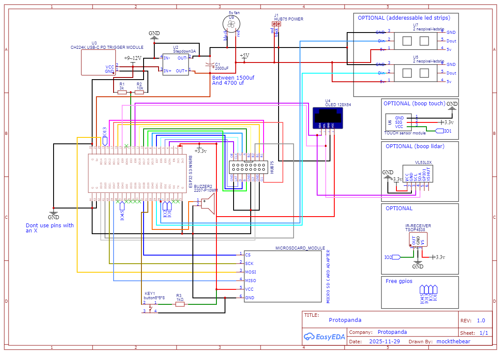

# Protopanda  
<p align="center">
  
</p>

Protopanda é uma plataforma open source (firmware e hardware) para controlar protogens. A ideia é ser simples o suficiente para que você só precise de um pouco de conhecimento técnico para fazê-lo funcionar, mas ao mesmo tempo flexível para que uma pessoa com o mínimo conhecimento de Lua possa fazer quase de tudo.

1. [Features](#features)   
2. [Alimentação](#alimentação)  
3. [Painéis](#painéis)  
4. [Tela e Expressões](#tela-e-expressões)  
5. [Tiras de LED](#tiras-de-led)  
6. [Bluetooth](#bluetooth)  
7. [Hardware](#hardware)   
8. [Montando o seu protopanda](#montando-o-seu-protopanda)
9. [Programação em Lua](#programação-em-lua)  

# Features  

- Dois núcleos Xtensa LX7 de 32 bits 240 MHz  
- 16 MB RAM  
- Suporte a vários painéis HUB75  
- Suporte a WLED  
- Usa Lua  
- Dados armazenados em um cartão SD  
- Expressões podem ser adicionadas ao cartão SD como arquivos PNG  
- Pode facilmente atingir 60 FPS  
- Suporte a BLE para controle remoto  
- Suporte a USB-C com PD (Power Delivery)  
- Saída de até 5V e 5A no modo PD  
- Suporte a tela OLED interna de 128x64 pixels para menu e interface  
- gay 🏳️‍🌈  

# Alimentação  

__TLDR: Use um power bank de pelo menos 20W com PD e USB-C.__

Existem dois modos: um que alimenta diretamente em 5V via USB e outro que possui gerenciamento de energia (conversor buck), que requer de 6,5V até 12V. Este segundo modo só é habilitado através de alterações físicas na PCB.

Cada painel HUB75 pode consumir até 2A no brilho máximo, então alimentar diretamente via USB em 5V pode ser problemático. Por isso, esta versão com o regulador ativa o PD (Power Delivery) no USB, solicitando 9V 3A, o que fornece energia suficiente para ambos os painéis. Infelizmente, esta versão consome muito mais energia.

Na maioria dos casos, você não estará operando os painéis no brilho máximo nem com todos os LEDs em branco, então a versão em 5V é a recomendada.da suporta [tiras de LED](#tiras-de-led), e há uma porta dedicada a elas. A saída também é de 5V, a mesma dos painéis. Como os LEDs são do tipo WS2812B, eles podem consumir até 20 mA por LED a 100% de brilho.  

# Painéis  

Os painéis utilizados também são conhecidos como painéis HUB75. Eles são controlados pela [biblioteca hub75 do mrcodetastic](https://github.com/mrcodetastic/ESP32-HUB75-MatrixPanel-DMA), e estes são os [painéis recomendados](https://pt.aliexpress.com/item/4000002686894.html).  
  
Eles são multiplexados, o que significa que apenas alguns LEDs estão ligados por vez. É rápido o suficiente para não ser percebido pelo olho humano, mas sob luz solar direta, é difícil tirar uma boa foto sem efeito de tearing.  
  

A resolução é de 64 pixels de largura e 32 pixels de altura. Com dois painéis lado a lado, a área total é de 128x32 pixels. A profundidade de cor é de 16 bits, no formato RGB565, o que significa vermelho (0-32), verde (0-64) e azul (0-32).  

## Buffer Duplo  

Para evitar outro tipo de tearing, quando um quadro está sendo desenhado enquanto o quadro está sendo alterado, habilitamos o uso de buffer duplo. Isso significa que desenhamos os pixels na memória, mas eles não aparecem imediatamente na tela. Quando chamamos `flipPanelBuffer()`, a memória em que desenhamos é enviada para o DMA para ser constantemente exibida no painel. Então, o buffer que usamos para desenhar muda. Isso aumenta o uso de memória, mas é um preço necessário a pagar.  

# Tela e Expressões  

O Protopanda usa imagens do cartão SD e alguns arquivos JSON para construir as sequências de animação. Todas as imagens devem ser `PNG`; posteriormente, são decodificadas para um formato bruto e armazenadas no [arquivo bulk de quadros](#arquivo-bulk).  

- [Carregando Frames](#carregando-frames)  
- [Expressões](#expressões)  
- [Pilha de Expressões](#pilha-de-expressões)  
- [Arquivo Bulk](#arquivo-bulk)  
- [Modo managed](#modo-managed)  

## Carregando Frames
Para carregar os quadros (frames), você precisa adicioná-los ao cartão SD e especificar suas localizações no arquivo `config.json`:
```json
{
  "frames": [
    {"pattern": "/expressions/normal_by_maremar (%d).png", "flip_left": true, "from": 1, "to": 4, "name": "frames_normal"},
    {"pattern": "/expressions/noise (%d).png", "flip_left": false, "from": 1, "to": 3, "name": "frames_noise"},
    {"pattern": "/expressions/amogus (%d).png", "flip_left": true, "from": 1, "to": 2, "name": "frames_amogus"},
    {"pattern": "/expressions/boop_cycle_%d.png", "flip_left": true, "from": 1, "to": 3, "name": "frames_boop"},
    {"pattern": "/expressions/boop_transiction_%d.png", "flip_left": true, "from": 1, "to": 3, "name": "frames_boop_transition"}
  ],
  "expressions": [],
  "scripts": [],
  "boop": {}
}
```

> Modificar o arquivo `config.json` adicionando ou removendo arquivos forçará o sistema a reconstruir o [arquivo de bulk de frames](#bulk-file).

Cada elemento no array `frames` pode ser tanto o caminho do arquivo quanto um objeto que descreve múltiplos arquivos. [Você pode usar esta página para ajudar.](https://onlinetexttools.com/printf-text)

* **pattern** (string)  
  Assim como no `printf`, que usa `%d` para especificar um número, ao usar `pattern`, é necessário ter os campos `from` e `to`. Por exemplo:  
  Dado o exemplo:
  ```json
  {"pattern": "/bolinha/input-onlinegiftools-%d.png", "from": 1, "to": 155},
  ```
  Isso carregará `/bolinha/input-onlinegiftools-1.png` até `/bolinha/input-onlinegiftools-155.png`.

* **flip_left** (bool)  
  Devido à orientação dos painéis, pode ser necessário inverter o lado esquerdo horizontalmente.

* **name** (string)  
  As animações são basicamente como:
  ```
  Desenhar frame 1
  esperar um tempo
  Desenhar frame 2
  ```
  Isso pode ser um problema se você codificar as animações diretamente e precisar adicionar um frame no meio. Para resolver isso, você pode criar um nome para uma imagem ou um grupo de imagens. O nome é apenas um identificador dado ao primeiro frame do `pattern`. Funciona como um offset.

* **color_scheme_left** (string)  
  Se você precisar inverter um ou mais canais de cor, use isso para fazê-lo.

## Expressões

Uma vez que os frames são carregados e a execução começa, é trabalho dos [scripts Lua](#programming-in-lua) gerenciar as expressões.  
As expressões são armazenadas em `expressions.json` na raiz do cartão SD.
```json
// Início do JSON //
{
  "frames": [],
  "expressions": [
    {"name": "normal", "frames": "frames_normal", "animation": [1,2,1,2,1,2,3,4,3], "duration": 250},
    {"name": "sus", "frames": "frames_amogus", "animation": "auto", "duration": 200},
    {"name": "noise", "frames": "frames_noise", "animation": "auto", "duration": 5, "onEnter": "ledsStackCurrentBehavior()  ledsSegmentBehavior(0, BEHAVIOR_NOISE) ledsSegmentBehavior(1, BEHAVIOR_NOISE)", "onLeave": "ledsPopBehavior()"},
    {"name": "boop", "frames": "frames_boop", "animation": [1,2,3,2], "duration": 250},
    {"name": "boop_begin", "frames": "frames_boop_transition", "animation": [1,2,3], "duration": 250, "transition": true},
    {"name": "boop_end", "frames": "frames_boop_transition", "animation": [3,2,1], "duration": 250, "transition": true}
  ],
  "scripts": [],
  "boop": {}
}
```
#### Expression Properties  

- **`name`** (string, *optional*)  
  Não é obrigatório ter um nome, mas é uma forma de facilitar a chamada de uma animação e visualizar seu nome no menu.

- **`frames`** (string)  
  O nome do grupo de frames que contém os frames desejados.

- **`animation`** (int[] or `"auto"`)  
  - `int[]`: O ID de cada frame a ser exibido (e.g., `[1, 2, 3]`).  
  - `"auto"`: Quando definido como "auto", os frames serão adicionados automaticamente em sequência. (e.g., `1, 2, 3...`).  

- **`duration`** (int)  
  A duração de cada frame.

- **`hidden`** (string)  
  Hide from menu selection 

- **`intro`** (string)  
  Esse parâmetro deve ser o nom e de uma outra animação que DEVE ser uma `tranistion=true`. Essa animação de introdução irá tocar sempre que essa expressão entrar

- **`outro`** (string)  
  Esse parâmetro deve ser o nom e de uma outra animação que DEVE ser uma `tranistion=true`. Essa animação de encerramento irá tocar sempre que essa expressão sair de cena

- **`transition`** (boolean)  
  Transforma no tipo `transition`. Isso fará com que essa animação só toque uma vez e quando chamada, seja inserida na pilha de animações sem subistituir a atual. Apenas tocar uma vez e voltar para a anterior

- **`repeats`** (int, default 1)
  Se a expressão é do tipo `transition`, você pdoe fazer com que ela se repita N vezes

- **`onEnter`** (string, Lua code)  
  Quando a animação assume o controle da tela, executa um código Lua.

- **`onLeave`** (string, Lua code)  
  Quando a animação para de executar (por estar marcada como `transition=true` ou porque outra animação assumiu o controle), executa um código Lua.

## Pilha de Expressões  

As expressões são armazenadas em uma pilha. Quando você adiciona uma animação que não se repete, ela pausa a animação atual e executa até o final da nova animação. Se você adicionar duas ao mesmo tempo, a última será executada. Quando terminar, a anterior será executada.  

## Arquivo Bulk  

Mesmo com o cartão SD, mudar os quadros não é tão rápido. A interface do cartão SD não é rápida o suficiente. Para acelerar, as imagens são decodificadas de PNG para dados brutos de pixels no formato RGB565 e armazenadas na flash interna. Todos os quadros são armazenados em um único arquivo chamado `arquivo bulk`. Isso é feito de forma que os quadros são armazenados sequencialmente e, mantendo o arquivo aberto, a velocidade de transferência é acelerada, atingindo 60 FPS.  

Toda vez que você adiciona ou modifica um novo quadro, é necessário reconstruir esse arquivo. Isso pode ser feito no menu ou chamando a função Lua `composeBulkFile`.  

## Modo managed

As animações são processadas pelo Núcleo 1, então você não precisa perder tempo precioso nos [scripts Lua](#programação-em-lua) atualizando-as. É possível mudar o quadro usando scripts Lua... Mas também é um desperdício. Então deixe isso para o outro núcleo, e você só precisa se preocupar em selecionar quais expressões deseja!  

Durante o modo gerenciado, o desenho dos quadros é tratado pelo Núcleo 1.  
  

# Tiras de LED  

O Protopanda suporta o protocolo de LED endereçável WS2812B e fornece um sistema simples para definir alguns comportamentos para a tira/matriz.  
  
  

# Bluetooth  

O Protopanda usa BLE. Até agora, está configurado para lidar com a pata de fursuit. Todas as informações, código-fonte e hardware podem ser encontrados aqui: [https://github.com/mockthebear/ble-fursuit-paw](https://github.com/mockthebear/ble-fursuit-paw)  
  

Consiste em um dispositivo BLE com um acelerômetro/giroscópio LSM6DS3 de 3 eixos e 5 botões. Ele continua enviando as leituras dos sensores e botões a cada 50~100 ms.  

O UUID padrão da pata de fursuit BLE é `d4d31337-c4c3-c2c3-b4b3-b2b1a4a3a2a1`, e o serviço para o acelerômetro/giroscópio/botões é `d4d3afaf-c4c3-c2c3-b4b3-b2b1a4a3a2a1`.  

Se você quiser mais de um controle remoto, é recomendado reprogramar o firmware de outro controlador e definir a parte `c4c3` do UUID para `c4c4` ou algo parecido.  

Para definir ambos os dispositivos como aceitos, adicione no seu `onSetup`:  
```lua  
function onSetup()  
    startBLE()  
    acceptBLETypes("d4d31337-c4c1-c2c3-b4b3-b2b1a4a3a2a1", "afaf", "fafb")
    beginBleScanning()  
```  

Eu sei, eu sei... é estático e não tem flexibilidade para aceitar qualquer tipo de dispositivo BLE/serviços... Talvez no futuro~

# Hardware  

O Protopanda foi projetado para rodar no ESP32-S3-N16R8, uma versão com 16 MB de flash, 384 kB de ROM, 512 kB de RAM e 8 MB de PSRAM octal. É necessário essa versão com mais espaço e PSRAM para ter RAM suficiente para rodar os painéis, BLE e Lua simultaneamente.  

No hardware, há uma porta para os dados HUB75, um conector para cartão SD, dois terminais parafusados para a saída de 5V, os pinos de alimentação, uma porta I2C e um pino para tira de LED.  

## Diagrama  

  

## Portas  

  

## Esquemático  

  

## Dois Núcleos  
O Protopanda utiliza e abusa dos dois núcleos do ESP32.  
* **Núcleo 0**  
Por padrão, o Núcleo 0 é projetado principalmente para gerenciar o Bluetooth. Quando não está fazendo isso, ele gerencia as animações e, quando o [Modo Gerenciado](#modo-gerenciado) está ativo, também cuida da atualização da tela de LED.  
* **Núcleo 1**  
O segundo núcleo lida com tarefas não relacionadas à tela. Ele possui a rotina que verifica o [nível de energia](#alimentação), atualiza as entradas, lê os sensores e chama a função Lua `onLoop`.  

# Montando o seu protopanda

Sei que fazer uma PCB do zero, usar componentes SDM é complicado. Porém, você pode usar peças que dá para comprar no aliexpresse montar uma versão reduzida do protopanda.

  

### Peças

* [5v 3A buck converter](https://aliexpress.com/item/1005005505907937.html)
* [PD trigger](https://aliexpress.com/item/1005007889747084.html)
* [SD Card modulo](https://aliexpress.com/item/1005008723789216.html)
* [Tela oled](https://aliexpress.com/item/1005006141235306.html)
* [ESP32 N16R9 dev board](https://aliexpress.com/item/1005009906920237.html)
* [Buzzer 5 or 3.3v](https://aliexpress.com/item/1005006201550296.html)
* [Connector para o painel HUB75](https://aliexpress.com/item/1005007851512814.html) (Get the 16 pin one)
For external use:
* 2x [hub75 screen](https://aliexpress.com/item/4000002686894.html)
* [Adderessable led strip](https://aliexpress.com/item/1005004752499978.html) (optional)


# Programação em Lua  

__[Lua functions reference](doc/lua-doc.pt-br.md)__

- [Script Lua Mínimo](#script-lua-mínimo)  
- [Ciclar Expressões a Cada Segundo](#ciclar-expressões-a-cada-segundo)  

## Script Lua mínimo  
```lua  
-- Script Lua mínimo em init.lua  

function onSetup()  
  -- Esta função é chamada uma vez. Aqui você pode iniciar o BLE, começar a escanear, configurar o painel, definir o modo de energia, carregar bibliotecas e preparar as tiras de LED e até ligar a energia.  
  -- Todas as chamadas aqui são feitas durante o SETUP, rodando no núcleo 0.  
end  

function onPreflight()  
  -- Aqui, todas as chamadas Lua são feitas a partir do núcleo 1. Você pode até deixar esta função em branco.  
  -- O Núcleo 0 só começará a gerenciar após 100 ms (o bip final).  
end  

function onLoop(dt)  
  -- Esta função será chamada em loop.  
  -- O parâmetro dt é a diferença em MS entre o início do último quadro e o atual. Útil para armazenar tempo decorrido.  
end  
```  

## Ciclar expressões a cada segundo  
```lua  
local expressions = dofile("/lualib/expressions.lua")  
local changeExpressionTimer = 1000 -- 1 segundo  

function onSetup()  
  setPanelMaxBrightness(64)  
  panelPowerOn() -- O brilho sempre começa em 0  
  gentlySetPanelBrightness(64)  
end  

function onPreflight()  
  setPanelManaged(true)  
  expressions.Next()  
end  

function onLoop(dt)  
  changeExpressionTimer = changeExpressionTimer - dt  
  if changeExpressionTimer <= 0 then  
    changeExpressionTimer = 1000 -- 1 segundo  
    expressions.Next()  
  end  
end  
```  
