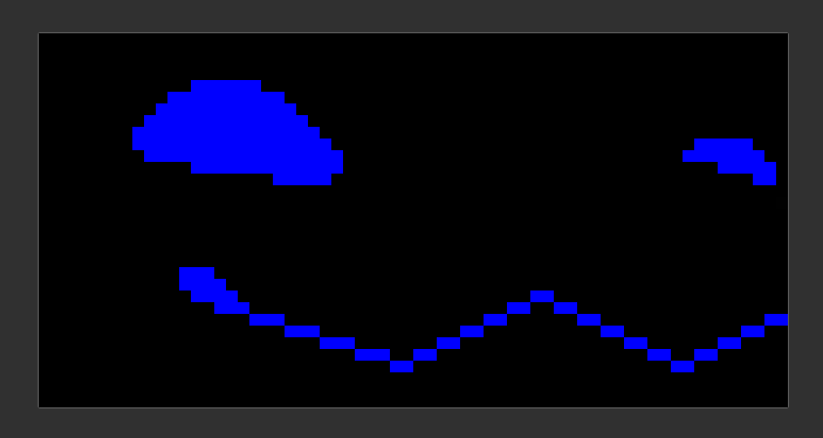

# Configurando

Antes de mais nada. Essa página é dedicada às configurações do seu protogen. Algumas configurações são definidas no código fonte. Essas configurações não serão discutidas aqui. 

> Tudo neste guia vai considerar uma versão não modificada do firmware.

> Em todas as partes destes guias, será considerado que você tem uma versão não modificada do Protopanda. 

> Algumas configurações são ativadas/desativadas no menu do seu protogen. Indo em `settings`

# Tópicos

1. [Criando expressões faciais](#expressões)
2. [Modificando o boop](#boop)
3. [Microfone, FFT e movimento da boca](#microfone)
4. [Mudando o método de entrada](#entrada)
5. [Mudando a cor dos LEDs laterais](#leds)
6. [Mudando a tela (migrando para o MAX7219)](#tela)
7. [Criando scripts](#scripts)


# Expressões

Todo o ponto do Protopanda é ser fácil de criar expressões, e agora você vai ver o quanto isso é fácil. 

Pra overlays de animação ou movimento da boca baseado no microfone, dá uma olhada na [seção de overlay na parte do microfone](#overlays)

## Por dentro do sistema

Tudo vai ser configurado dentro do arquivo `animation.json`. As duas partes importantes que precisamos nesse arquivo são: 

* frames
* expressions

O funcionamento interno do Protopanda foi planejado pra desenhar essas animações e pular entre elas sem nenhum delay ou carregamento. Pra fazer isso em um hardware bem fraquinho, foram precisos alguns truques. 
Pra desenhar uma animação, primeiro precisamos dos pixels dela. Carregar imagens e decodificar os dados comprimidos do cartão SD demora. Tipo, demora muito, se fizéssemos isso enquanto o protogen roda a gente ficaria limitado a uns 5fps.

Pra acelerar as coisas, carregamos todas as imagens uma vez, decodificamos todas e guardamos numa espécie de "imagem maior", ou um [texture atlas ou spritesheet](https://en.wikipedia.org/wiki/Texture_atlas). Carregar um texture atlas inteiro provavelmente comeria toda a RAM do coitado do Esp32, então precisamos carregar cada imagem individual, uma de cada vez.

Depois que essas imagens são carregadas e guardadas dentro da flash interna do esp32 (bem, bem mais rápida que o cartão SD), a gente só precisa dizer:
- Desenha essa seção aqui
- Agora desenha essa outra seção
- Agora essas outras aqui, por favorzinho?

Falar parece difícil, mas fazer isso com o código já existente é supimpa fácil. Com todos os sprites carregados, tudo que precisamos é especificar a ordem da animação, e quanto tempo cada frame deve ficar na tela.

Então, bora trabalhar!

## Criando frames.

Pra criar um frame, primeiro abra seu editor de imagem favorito. Eu adoro usar o paint do windows pra isso. Você pode usar o [aseprite](https://www.aseprite.org/) ou o [paintnet](https://paint.net/) também.

Comece com uma imagem de 64x32 pixels. Depois deixe o fundo todo preto. Falo PRETO RGB 0,0,0 #000000 mesmo! 

Aí desenhe a cara do seu protogen ali



Salve isso como `happy1.png`. Depois crie outra, mas mude um pouco. Mude pra o quê? Sei lá, viaja, experimenta, tenta o que seu coração desejar.


Digamos que a gente nomeou como "happy1.png", "happy2.png" ... até "happy7.png"

Precisamos mover isso pro cartão SD. Uma vez no cartão SD, abra no seu editor de texto favorito o arquivo `animation.json` e adicione a seguinte parte:

```json
{
  "frames"     : [
        {
        "files"   :  ["/happy1.png", "/happy2.png", "/happy2.png", "/happy3.png", "/happy4.png", "/happy5.png", "/happy6.png", "/happy7.png"],
        "name"      : "happy_frames"
        },
    <The rest of the animation.json>
```

O mínimo que você precisa num objeto de frame é quais arquivos você quer carregar e o nome.

Repara que a gente sempre precisa começar o caminho com uma `/`. Se você salvou as imagens na pasta `expressions`, ficaria tipo `/expressions/happy1.png`.

Agora salve e coloque o cartão SD de volta no protogen. Na inicialização, se você não fodeu a [sintaxe do JSON](https://developer.mozilla.org/en-US/docs/Learn_web_development/Core/Scripting/JSON), vai aparecer uma barra de carregamento. 
**Toda vez que você adiciona ou remove frames, esse processo vai acontecer.** Quando terminar, eis que, NADA MUDOU.

Isso é porque só criamos os frames, óbvio. Precisamos dizer como isso vai tocar.

Voltando pro `animation.json`, vamos revisar algumas coisas antes de realmente fazer algumas animações

#### Carregando arquivos

Digamos que você não quer digitar cada nome individual no json. Tem um padrão no nome, né? happy(número).png. Podemos usar isso!

```json
{
  "frames"     : [
        {
        "pattern"   :  "/happy%d.png",
        "from"      : 1,
        "to"        : 7,
        
        "name"      : "happy_frames"
        },
    <The rest of the animation.json>
```
Isso vai fazer a mesma coisa que o json que fizemos antes. Mas substituímos o número por `%d` e dizemos de onde começa e onde termina. Essa é uma notação `sprintf`. Você pode usar [essa ferramenta](https://onlinephp.io/sprintf) pra ajudar com isso.

#### Espelhando

Se você carregar e tocar os frames carregados, vai notar que no lado direito da tela a imagem vai estar espelhada. Isso é porque elas vão ser desenhadas duas vezes, e uma das telas nós dobramos fisicamente pro outro lado. Então precisamos espelhar!

```json
{
  "frames"     : [
        {
        "pattern"   :  "/happy%d.png",
        "from"      : 1,
        "to"        : 7,
        "flip_left" : false,
        "flip_right": true,
        "name"      : "happy_frames"
        },
    <The rest of the animation.json>
```

É assim que se faz, e é recomendado que você sempre coloque essas duas opções se a imagem não tiver texto.

#### Esquema de cores por lado.

Talvez você queira que seu proto tenha heterocromia? Tipo, um lado com cores diferentes? Por padrão todas as imagens são carregadas como se fossem uma imagem RGB. Mas você pode especificar pra desenhar como RBG... ou BGR, ou GRB...? 
Não é uma coisa convencional, mas é suportado mesmo assim. Pra isso você só precisa adicionar:
```json
{
    <the rest of your frame section>
    "color_scheme_right": "rgb",
    "color_scheme_left": "rbg"
}
```
Nos próximos exemplos, vamos considerar que você não adicionou isso.

## Criando animações

Agora que temos os frames carregados, lembra do nome que você definiu. Vá no seu `animation.json` na seção `expressions`. 
Vamos adicionar uma animação básica. Temos 7 frames. 

```json
{
    "frames": [
        {
        "pattern"   :  "/happy%d.png",
        "from"      : 1,
        "to"        : 7,
        "flip_left" : false,
        "flip_right": true,
        "name"      : "happy_frames"
        },
        <all your frames>
    ],
    "expressions": [
        {
        "name"     : "happy",
        "frames": "happy_frames",
        "animation": [1,2,3,4,5,6,7],
        "duration" : 75
        },
        <the rest of your expressions>
```
Basicamente estamos dizendo:
"Usando os frames `happy_frame`, vamos tocar sequencialmente de 1 até 7. Cada frame vai ficar 75 milissegundos na tela. E no menu de seleção de expressão, o nome dessa expressão vai ser `happy`.

> O primeiro frame sempre vai ser 1. Não importa se você definir `from: 10, to: 15`, vai ser `1,2,3,4,5`.

É isso! Você tem sua primeira animação. Liga seu proto e testa!

### Presets

Às vezes você desenha tipo 20 frames e pensa: caramba, vou ter que fazer isso?
```json
[1,2,3,4,5,6,7,8,9,10,11,12,13,14,15,16,17,18,19,20],
```
A resposta é, **nem sempre**!
Existem alguns presets, nesse caso específico você pode simplesmente substituir por `loop`:
```json
    {
        "name"     : "happy",
        "frames": "happy_frames",
        "animation": "loop",
        "duration" : 75
    }
```
Desse jeito o código vai fazer uma animação em loop. 

| Nome da macro  | Comportamento                                                                                                              |
|----------------|-----------------------------------------------------------------------------------------------------------------------------|
| auto           | Toca do primeiro até o último frame, e quando termina volta pro primeiro frame: 1,2,3,4,5,6,7 e depois de novo 1,2,3,4,5,6,7 |
| loop           | Igual ao auto                                                                                                                |
| pingpong       | Toca do primeiro frame até o último, depois toca a animação ao contrário: 1,2,3,4,5,6,7,6,5,4,3,2,1 e repete                 |
| loop_backwards | Igual ao loop, mas começa no último e toca até o primeiro.                                                                  |

### Transições

Digamos que você quer fazer uma transição suave entre duas animações.

Happy -> Sad

Pra isso, você precisa de uma terceira animação:

Happy -> Happy-to-Sad -> Sad

```json
    {
        "name"     : "happy",
        "frames": "happy_frames",
        "animation": "loop",
        "duration" : 75
    },
    {
        "name"     : "hayyp-to-sad",
        "frames": "happy_to_sad_frames",
        "animation": "loop",
        "duration" : 75
    },
    {
        "name"     : "sad",
        "frames": "sad_frames",
        "animation": "loop",
        "duration" : 75
    }
```

Depois que você troca as animações, seja por um boop ou mudando no menu, você precisa que essa happy-to-sad toque pelo menos uma vez e depois toque a sad. Então pra isso você vai adicionar isso na animação sad:

```json
    "intro": "hayyp-to-sad"
```

Desse jeito, quando você começa a tocar sad, a animação de introdução vai tocar uma vez até o fim, aí `sad` entra.

Você pode até fazer isso:

```json
    {
        "name"     : "happy",
        "frames": "happy_frames",
        "animation": "loop",
        "duration" : 75
    },
    {
        "name"     : "hayyp-to-sad",
        "frames": "happy_to_sad_frames",
        "transition": true,
        "animation": "loop",
        "duration" : 75
    },
    {
        "name"     : "hayyp-to-sad",
        "frames": "sad_to_happy_frames",
        "transition": true,
        "animation": "loop_backwards",
        "duration" : 75
    },
    {
        "name"     : "sad",
        "frames": "sad_frames",
        "animation": "loop",
        "intro"    : "happy_to_sad_frames",
        "outro"    : "sad_to_happy_frames",
        "duration" : 75
    }
```

Desse jeito a animação vai tocar quando começa e quando sai. 
Também é uma boa ideia adicionar `"transition": true,` em todas as animações que são só transições. Com esse valor definido como true, essas animações não vão aparecer na seleção de expressão.

### Scripts nas animações

Já que todo o sistema de animação roda principalmente na parte de C++ do código, os menus e a seleção são em lua, então podemos rodar algum código quando a animação é selecionada. Podemos usar:

```json
    {
        "name"     : "sad",
        "frames": "sad_frames",
        "animation": "loop",
        "intro"    : "happy_to_sad_frames",
        "outro"    : "sad_to_happy_frames",
        "duration" : 75,
        "onEnter": "tone(440)",
        "onLeave": "tone(1440)"
    }
```

Desse jeito, quando selecionamos a animação sad, o buzzer do proto vai fazer um bipe num tom mais grave, e quando sair vai soar um tom mais agudo.


## Primeira animação na inicialização

Assim que seu protogen liga, a primeira animação a ser tocada é definida no `misc.json` como `"starting_animation": "normal",`.
Pra mudar pra sua nova animação, a `happy`, só define assim:

`"starting_animation": "happy",`


# Boop

Toda a lógica do boop é definida no `misc.json`. Os padrões são: 

```json
{
    "boop": {
        "//comment": "O trigger_mode pode aceitar 'gpio' ou 'lidar'",
        "trigger_mode": "gpio", 
        "gpio": 48,
        "power_gpio": 13,
        "gpio_state": 1,
        "enabled": true,
        "boopAnimationName": "boop",
        "transictionOnlyOnAnimation": "normal",
        "transictionInOnlyOnSpecificFrame": 1
    }
```

Vamos passar por cada configuração. Primeiro, tem dois modos pra ativação do boop. São eles **gpio** e **lidar**. Lidar é altamente não recomendado e está sendo descontinuado, então não vamos falar sobre ele.

## Boop como GPIO

Você provavelmente já conhece a palavra [GPIO](https://en.wikipedia.org/wiki/General-purpose_input/output). Quando esse modo é ativado, decidimos quando o boop está ativo baseado em um determinado gpio estar em um determinado estado.

Já que o guia recomenda usar o GPIO 48 e um sensor de toque ttp223

Quando você toca nele, ele manda um sinal HIGH na saída. Então detectamos quando está em HIGH.

Portanto:
```json
{
        "gpio": 48,
        "gpio_state": 1,
        "enabled": true, //Sim, estamos usando o sensor >.>
}
```
Esses sensores são chatinhos, e se você ligar seu proto enquanto está segurando perto do sensor de toque, ele pode ficar travado dizendo: "ei, tem algo me tocando". Isso não é bom, por isso o código é esperto o suficiente pra detectar que quando o sensor fica ligado por tempo demais, devemos desligá-lo. É por isso que no guia a gente diz pra ligar o GPIO 13 no VCC do sensor.  

* `"power_gpio": 13,`

## Animação do boop

Agora queremos dizer: Ei, quando o boop for acionado, por favor vá pra animação `sad`.

Pra isso, só precisamos fazer isso:

```json
{
        "gpio": 48,
        "gpio_state": 1,
        "power_gpio": 13,
        "enabled": true, 
        "boopAnimationName": "sad"
}
```

Pronto. É isso. 

> Intros e outros também vão tocar aqui.

Mas digamos que você quer fazer algo um pouco mais caprichado. Digamos que você tem uma animação de tela azul da morte e outras que, se simplesmente forem pra animação de boop, ficariam estranhas. Por isso você pode adicionar isso:

* `"transictionOnlyOnAnimation": "happy",`

Desse jeito, o boop só vai ser acionado quando `happy` estiver tocando.

Mas digamos que você fez o proto piscar o olho e não quer que a animação comece a tocar enquanto os olhos dele estão fechados. Por isso você adiciona isso:

* `"transictionInOnlyOnSpecificFrame": 1`

Agora o boop só vai começar a tocar quando a animação estiver no primeiro frame.

# Microfone

O Protopanda não tem suporte pra modulação de voz ou gravação de voz. Então o microfone é usado só pro movimento da boca e pro FFT.

Qualquer gpio livre entre 1 e 9 pode ser usado como microfone. O padrão é o pino 3.  
A configuração do microfone fica no `misc.json`

```json
{
    "fft": {
        "gpio": 3,
        "samples": 512,
        "sampling_frequency": 44100,
        "noise_threshold": 5500,
        "band_count": 32,
        "speech_band_start": 2,
        "speech_band_end":  8,
        "speech_min_energy": 50000,
        "speech_max_energy": 200000,          
        "speech_frist_frame_threshold": 40000,
        "enabled": true
    }
```

## FFT

Aqui é um pouco complexo, até pra quem já é acostumado com desenvolvimento de software. É uma parte do processamento de sinais, chamada Transformada de Fourier.
Usamos uma chamada [Transformada Rápida de Fourier](https://pt.wikipedia.org/wiki/Transformada_r%C3%A1pida_de_Fourier). Que basicamente pega os dados de áudio e transforma nas frequências básicas que compõem o som.

Que diabos? Por que você tá me contando isso?!
Bom, isso é o FFT rodando e mostrando o resultado no painel:


Algumas pessoas chamam isso de "visualizador de áudio" ou "modo rave". Essa é a base das expressões reativas à voz.

Você pode ligar esse overlay indo nas configurações do seu proto e procurando por `FFT [OFF]`.

### Parâmetros do FFT

Agora fica um pouco complexo. Pra fazer um FFT direito, precisamos amostrar alguns dados do GPIO 3 (padrão) numa certa [taxa de amostragem](https://en.wikipedia.org/wiki/Sampling_(signal_processing)).

Por padrão amostramos a 44100Hz `"sampling_frequency": 44100,`. Também alocamos 2x 512 floats pra guardar esses dados `"samples": 512,`.
Sempre usando dois buffers, então tecnicamente, 1024, um total de 4kb. **Fique de olho no tamanho livre do heap ao mudar esse número**.
Alguns valores não são aceitos, eles precisam ser múltiplos de 2. Caso dê falha ao inicializar o FFT, confira os logs, vai ter informação sobre por que foi rejeitado. Isso é um requisito da API do ESP32.

A cada amostra precisamos fazer a análise. Os parâmetros do FFT são:
```json
{
    ...
    "noise_threshold": 5500,
    "band_count": 32,
    ...
}
```

Você pode aumentar a quantidade de bandas pra deixar as coisas mais suaves. Eu acho que 32 é uma boa quantidade pro que é necessário. Mas você pode aumentar à vontade. Pra evitar ruído, você pode aumentar ou diminuir esse threshold. Ele vai cortar qualquer valor abaixo disso e não vai contar pro valor da banda do FFT. 
Esse threshold também pode ser mudado em tempo real em **settings>microphone config**.

### Calibrando o microfone

Dentro das configurações, tem uma opção pra calibrar. É um procedimento bem direto. Mas basicamente ele usa a sua fala pra tentar achar uma certa faixa de frequência e o ruído do seu ambiente pra fazer a boca se mexer de acordo. Tem valores padrão nessa seção do FFT, mas assim que você muda algo na configuração do microfone, eles sempre vão ser sobrescritos:

```json
{
    ...
        "speech_band_start": 2,
        "speech_band_end":  8,
        "speech_min_energy": 50000,
        "speech_max_energy": 200000,          
        "speech_frist_frame_threshold": 40000,
    ...
}
```

Mas o que tá escrito ali em cima quer dizer:

Vamos considerar só da banda 2 até a 8 como sendo onde ficam as frequências de fala, qualquer coisa depois disso é descartada.
Depois vamos somar o valor de cada banda e conseguir um valor de "energia".

Aí a gente suaviza o nível de energia entre cada frame usando:

$$\alpha = 1 - e^{-\Delta t / \tau}$$

$$E = E_{prev} \cdot (1 - \alpha) + E_{cur} \cdot \alpha$$

Pra sequer começar a checar, primeiro verificamos se a energia é maior que `speech_frist_frame_threshold`. 

Uma vez que é maior, podemos começar a checar o acionamento. 

Tau é definido como:
```lua
local tau = (currentEnergy > _M.lastEnergyLevel) and 0.05 or 0.2
``` 

Agora, se a energia chegar pelo menos em `speech_min_energy`, aí mudamos o trigger pra true e definimos como nível 2.
Conforme o nível de energia sobe, o nível continua aumentando até chegarmos em `speech_max_energy`. 

O que é esse nível? Bom, é um número arbitrário que podemos definir. Agora mesmo o nível é definido como o id do frame da animação da boca que usamos. Mas pode ser qualquer número.

## Overlays

Overlays são sprites desenhados por cima da animação que está tocando no momento. Esses sprites podem ser controlados usando Lua. Todos eles ficam no `animation.json`.

Sinceramente, toda a seção de overlays merece uma seção de guia dedicada, então por enquanto vamos só cobrir o movimento da boca.

### Overlay de movimento da boca

Na seção `overlays`, essa é a definição do movimento da boca:

```json
{
    "overlays"   : [
        {
        "name"    : "mouth",
        "elements": [
            {
            "sprites"           : [
                "/expressions/overlays/mouth1.png",
                "/expressions/overlays/mouth2.png",
                "/expressions/overlays/mouth3.png",
                "/expressions/overlays/mouth4.png",
                "/expressions/overlays/mouth5.png"
            ],
            "transparency": false,
            "behavior"         : {
                "mode": "frame_by_fft_level",
                "push_to_talk_button": "BUTTON_BACK",
                "x": 11,
                "y": 19,
                "attack": 0.05,
                "release": 0.2
            }
            }
        ]
        }
    ]
}
``` 

Nos bastidores, o que isso faz é basicamente alimentar o controlador de FFT dizendo:
"Os níveis vão de 1 a 5", só me dá o nível atual.

Então basicamente aqui você especifica os frames da boca, conforme eles vão abrindo com base nos níveis


E depois especificamos onde isso deve ser desenhado por cima.


# Entrada

O Protopanda foi feito pra ser controlado. Tipo, mudar animações, navegar pelos menus, jogar. Então pra isso precisamos definir um modo de entrada.

Por padrão, usamos [Bluetooth de baixa energia (BLE)](https://en.wikipedia.org/wiki/Bluetooth_Low_Energy), mas você também pode usar um controle infravermelho se ligar as coisas direito. 

No `keybinds.json`, você vai encontrar isso:

```json
{
  "input": {
    "//comment0": "Os modos de entrada disponíveis atualmente são 'infrared', 'ble' e 'none'",
    "mode": "BLE",
    "//comment1": "'enableHidControllers' permite que controles genéricos, como dispositivos BLE HID, se conectem ao Protopanda. O suporte é limitado",
    "enableHidControllers": true,
    "pairController": true,
    "maxBleDevices": 1,
    "drivers": ["panda", "BLE-M3", "beauty-r1"]
  },
```

Lá você pode mudar o modo de entrada.

## BLE

Pra bluetooth de baixa energia, você vai precisar dessas diretivas dentro do input:

```json
{
    "mode": "BLE",
    "enableHidControllers": true,
    "pairController": true,
    "maxBleDevices": 1,
    "drivers": ["panda", "BLE-M3", "beauty-r1"]
}
```

Idealmente, você usaria só o controle do Protopanda, aquele que é feito em cima do NRF52832 com código customizado e tudo mais. Esse é o ideal. Mas nem todo mundo consegue fazer isso, já que não é uma alternativa amigável pra iniciantes. Você pode gambiarrar algo usando outro esp32, mas isso também é um caminho longo até chegar lá. 

Então a maioria das pessoas que segue a rota DIY vai usar os controles recomendados. Esses controles são só mouses e teclados BLE. Tipo, literalmente, parecem só um teclado de mão, mas estão simulando um mouse. 
Qualquer dispositivo que se apresente como um dispositivo HID vai conseguir conectar ao Protopanda quando `"enableHidControllers": true,` está ativado. Se esse dispositivo vai ser totalmente suportado pelo código é outra questão. 

Quando você liga o Protopanda pela primeira vez, ele vai exigir que um controle seja pareado. Em outras palavras, ele vai iniciar no modo de pareamento por causa do `"pairController": true,`. Desativando isso, o Protopanda vai ficar o tempo todo procurando pelo controle (escaneando). Não é o ideal, principalmente numa furcon. Você pode acabar conectando sem querer no mouse ou teclado de outra pessoa.

E sim, o Protopanda também suporta mais de um controle conectado ao mesmo tempo, até quatro. `"maxBleDevices": 1,`. A menos que você tenha um uso bem específico, não tem motivo pra aumentar isso.

O Protopanda tem uma espécie de scripts 'driver' pra lidar com dispositivos BLE específicos. Agora mesmo, o HID é definido como um driver básico. Então outros drivers podem incrementar o comportamento dele. Por isso o 'BLE-M3' e o 'beauty-r1' estão ali. Esses são dispositivos bobinhos que simulam os movimentos de um mouse. O único propósito deles é ficar rolando a tela sem parar (doomscroll) pra você enquanto você aperta os botões. Os drivers simplesmente identificam os pacotes e encontram o padrão de cada botão.

Já o driver 'panda' de fato lida com a conexão, envia e recebe mensagens. O script de cada driver fica no cartão SD em `/lualib/drivers`.

Isso é o básico de um driver:

```lua
local panda = {
	type="core",

	mode = {
        'panda'
    },
}

function panda.onSubscribeMessagePanda(connectionId, clientId, data)
    --Parse data
end

function panda.onDisconnectPanda(connectionId, controllerId, reason)
    log("Disconnected "..connectionId.." due ".. reason)
    drivers.DisconnectDevice(controllerId, 'panda')
end

function panda.onConnectPanda(connectionId, controllerId, address, name)
    drivers.ConnectDevice(controllerId, address, "panda")
    panda.handler:WriteToCharacteristics({0,0,0,controllerId}, connectionId, "d4d3fafb-c4c1-c2c3-b4b3-b2b1a4a3a2a1", true)
end


function panda.onEnable()
    panda.handler = BleServiceHandler("d4d31337-c4c1-c2c3-b4b3-b2b1a4a3a2a1")
    panda.handler:SetOnConnectCallback(panda.onConnectPanda)
    panda.handler:SetOnDisconnectCallback(panda.onDisconnectPanda)
    panda.pandaListener = panda.handler:AddCharacteristics("d4d3afaf-c4c1-c2c3-b4b3-b2b1a4a3a2a1")
    panda.pandaListener:SetSubscribeCallback(panda.onSubscribeMessagePanda)
    panda.pandaListener:SetCallbackModeStream(true)
    return true
end

return panda
```

## Controle infravermelho

Quando o modo é definido como infrared, todas as configurações de BLE ficam inúteis, mas a diretiva `infrared` na raiz do `misc.json` passa a ser obrigatória:


```json
{
  <input directive>
  "infrared": [
    {
      "//comment": "Controle genérico",
      "usercode": "FF00",
      "bind": {
        "B9": "press(BUTTON_UP)",
        "EA": "press(BUTTON_DOWN)",
        "BB": "press(BUTTON_LEFT)", 
        "BC": "press(BUTTON_RIGHT)",
        "BF": "press(BUTTON_CONFIRM)",
        "E6": "press(BUTTON_BACK)",
        "BA": "press(BUTTON_AUX_A)",
        "F3": "setRainbowShader(true)",
        "E7": "setRainbowShader(false)",
        "F7": "expressions.Next()",
        "E3": "expressions.Previous()",
        "A5": "press(BUTTON_BACK, 1)"
      }
    }
  ]
}
```

Resumindo, cada controle infravermelho [manda um pacote de dados](https://learn.sparkfun.com/tutorials/ir-communication/all) quando você aperta um botão. Normalmente esse pacote de dados é composto por um usercode e um id de botão.
Você pode usar um decodificador ou pegar os opcodes do seu controle na internet. Também é fácil programar algo num arduino só pra despejar esses opcodes. 

Mas isso é trabalho demais, né? Só aponta seu controle pro receptor de infravermelho do Protopanda e aperta um botão. Se você estiver no monitor serial (ou checando os logs depois) vai ver uma mensagem assim:
> Unmapped IR command with usercode FFBC and opcode F9

Aí está! Você tem todos os dados. Digamos que você apertou na ordem: cima, baixo, esquerda, direita, confirmar, voltar, e você conseguiu:
```
Unmapped IR command with usercode FFBC and opcode F9
Unmapped IR command with usercode FFBC and opcode F8
Unmapped IR command with usercode FFBC and opcode F7
Unmapped IR command with usercode FFBC and opcode F6
Unmapped IR command with usercode FFBC and opcode F5
Unmapped IR command with usercode FFBC and opcode F4
```

Então você só faz isso:

```json
{
  <input directive>
  "infrared": [
    {
        <the other IR controller>
    },
    {
      "//comment": "Meu novo controle ^.^",
      "usercode": "FFBC",
      "bind": {
        "F9": "press(BUTTON_UP)",
        "F8": "press(BUTTON_DOWN)",
        "F7": "press(BUTTON_LEFT)", 
        "F6": "press(BUTTON_RIGHT)",
        "F5": "press(BUTTON_CONFIRM)",
        "F4": "press(BUTTON_BACK)",
      }
    }
  ]
}
```

Viu? Fácil o suficiente!

Você pode até fazer algo mais complexo tipo:

```json
"F3": "expressions.Next()",
```

Aquele trecho de texto ali é só código lua. Então viaja!

# LEDs

Mudar o comportamento dos LEDs laterais é uma questão de mudar a configuração no `hardware.json` ou programar seu próprio padrão.

## O jeito fácil

O jeito fácil é ir no `hardware.json` e editar a seção `leds`.
Digamos que você quer deixar o lado esquerdo vermelho e o direito roxo. Então você precisa fazer isso:
```json
{
    <the rest of your file>
    "leds": { 
        "pin_mode": "double",
        "groups":[
            {
                "pin_side": "left",
                "led_count": 64,
                "r": 255,
                "g": 0,
                "b": 0,
                "mode": "color_rgb"
            },
            {
                "pin_side": "right",
                "led_count": 64,
                "r": 255,
                "g": 0,
                "b": 140,
                "mode": "color_rgb"
            }
        ]

    }
}
```

Agora você pergunta:
"Ok, `mode: color_rgb`. Quais são os outros modos?


| Modo | Descrição | Parâmetros |
|------|-----------|------------|
| `none` | LEDs ficam apagados | Nenhum |
| `pride` | Animação da bandeira do orgulho arco-íris | Nenhum |
| `rotate` | Cor rotacionando ao longo da fita | `speed` (ms) - velocidade da rotação |
| `random_color` | Cada LED pisca cores aleatórias | Nenhum |
| `fade_cycle` | Ciclo gradual de cores | `hue` (0-255), `speed` (ms), `min_brightness` (0-255) |
| `rotate_fade_cycle` | Ciclo de cores com rotação | `hue`, `speed`, `min_brightness`, `rotate_speed` (ms) |
| `color_rgb` | Cor RGB estática | `r` (0-255), `g` (0-255), `b` (0-255) |
| `color_hsv` | Cor HSV estática | `h` (0-255), `s` (0-255), `v` (0-255) |
| `random_blink` | LEDs piscam aleatoriamente | `base_hue` (0-255), `hue_variance` (0-255), `brightness` (0-255), `blink_speed` (ms) |
| `icon_x` | Mostra um padrão em "X" | Nenhum |
| `icon_y` | Mostra um padrão em "Y" | Nenhum |
| `icon_v` | Mostra um padrão em "V" | Nenhum |
| `rotate_sine_v` | Variação de brilho em onda senoidal | `hue` (0-255), `saturation` (0-255), `speed` (ms) |
| `rotate_sine_s` | Variação de saturação em onda senoidal | `hue` (0-255), `brightness` (0-255), `speed` (ms) |
| `rotate_sine_h` | Variação de matiz em onda senoidal | `sat` (0-255), `brightness` (0-255), `speed` (ms) |
| `fade_in` | Efeito gradual de fade-in | `hue` (0-255), `saturation` (0-255), `step` (0-255), `delay` (ms) |
| `noise` | Efeito de ruído aleatório | `step` (0-255), `delay` (ms) |


Se seu modo não estiver presente aqui, você vai ter que ir pelo [jeito difícil](#o-jeito-difícil).

Esses são os modos existentes que você pode usar. Veja, se você decidir usar `noise`, você não adiciona os parâmetros r,g,b, você faz assim:
```json
{
    <the rest of your file>
    "leds": { 
        "pin_mode": "double",
        "groups":[
            {
                "pin_side": "left",
                "led_count": 64,
                "step": 5,
                "delay": 10,
                "mode": "noise"
            },
            {
                "pin_side": "right",
                "led_count": 64,
                "step": 5,
                "delay": 10,
                "mode": "noise"
            }
        ]

    }
}
```

Cada modo tem seus parâmetros disponíveis.


## O jeito difícil

O jeito difícil permite que você faça o que quiser. Nesse modo você basicamente vai ignorar a seção `leds` e programar seus próprios padrões usando lua. É bem direto!
Vamos aprender como fazer esse efeito:


Abra o arquivo init.lua, você vai ver essas duas funções:
```lua


<some code here before>


function onSetup()
    <some code here before>

    leds.begin()

    < the rest of the function >
end

function onPreflight()
    ledsSetManaged(true)
    setPanelManaged(true)

    < the rest of the function >

end

function onLoop(dt)
    overlays.update(dt)
    drivers.update()
    input.update()
    expressions.update()
    if not scripts.Handle(dt) then
        return
    end
    menu.handleMenu(dt)
end
```

Na primeira função você vai ver que temos um `leds.begin()`. Essa função basicamente vai ler o json e chamar:
```lua
    --countLeft e countRight são 64 por padrão no json dos leds
    ledsBeginDual(countLeft, countRight, 0) 
    <After some more code>
    ledsSegmentBehavior(groupId, behavior, param1, param2, param3, param4)
```
Isso vai definir o comportamento. Esse comportamento é tratado pelo core que cuida da animação e do bluetooth. Mas sinceramente, não estamos usando isso. Você pode deixar sem mudar, ele vai iniciar o led pra gente. Ou comentar aquela linha `leds.begin` e iniciar os leds usando `ledsBeginDual` por conta própria.

Depois disso, na segunda função devemos substituir: `ledsSetManaged(true)` por `ledsSetManaged(false)`. Isso vai dizer: "Não atualize os leds no segundo core". Isso vai deixar os leds sem nem acender. E é isso que queremos! Nada vai mudar neles.

Agora, dentro do `onLoop`, é aqui que vamos programar nosso comportamento. Já que declaramos 64 leds do lado esquerdo e 64 leds do lado direito, isso dá um total de 128 leds. Isso é importante porque do led 0 ao led 63 são os leds da esquerda. E de 64 a 127 são os leds da direita.

Então digamos que a gente quer definir o primeiro led do lado esquerdo como vermelho e o primeiro do lado direito como azul?
```lua
ledsSetColor(0, 255, 0, 0)
ledsSetColor(63, 0, 0, 255)
ledsDisplay()
```
Você pode conferir a [referência lua aqui](lua-doc.pt-br.md), mas resumindo. Isso está dizendo que o led `0` vai ter a cor RGB `255,0,0`. Fazemos o mesmo para o led 63, que é o primeiro led do outro lado, mas mandamos `0,0,255`.
E depois disso você manda o comando pra que os leds atualizem a cor deles com `ledsDisplay()`.
Também podemos definir um segmento inteiro com uma única cor:
```lua
ledsSegmentColor(0, 255, 0, 0)
ledsSegmentColor(1, 0, 0, 255)
ledsDisplay()
```
Isso vai deixar o lado esquerdo todo vermelho e o direito todo azul. E sim, você pode fazer isso pra cada led individualmente ou todos iguais.

Então, se fizermos uma programação esperta:
```lua
local maxBrightDuration = 0  
local isMaxBright = false
local flashState = false
local nextLightning = 0
local flashes = 0

function thunderLed(dt)
    if isMaxBright then
        if maxBrightDuration <= 0 then  
            if flashes <= 0 then  
                isMaxBright = false
                ledsSegmentColor(0, 0, 120, 0) --Segmento direito verde metade do brilho
                ledsSegmentColor(1, 0, 120, 0) --Segmento esquerdo verde metade do brilho
                ledsDisplay() -- Atualiza os leds
            else 
                maxBrightDuration = math.random(5, 50)
                if flashState then
                    ledsSegmentColor(0, 0, 120, 0) --Segmento direito verde 100% do brilho
                    ledsSegmentColor(1, 0, 120, 0) --Segmento esquerdo verde 100% do brilho
                else 
                    ledsSegmentColor(0, 0, 255, 0) --Segmento direito verde 100% do brilho
                    ledsSegmentColor(1, 0, 255, 0) --Segmento esquerdo verde 100% do brilho
                end
                flashState = not flashState
                ledsDisplay() -- Atualiza os leds
            end
            flashes = flashes -1
        end
        maxBrightDuration = maxBrightDuration - dt
    else 
        if nextLightning <= 0 then  
            nextLightning = math.random(200, 2500)
            maxBrightDuration = math.random(20, 50)
            isMaxBright = true
            flashState = true
            if math.random(0, 1000) < 300 then 
                flashes = math.random(0,3)*2
            else 
                flashes = 0
            end
            ledsSegmentColor(0, 0, 255, 0) --Segmento direito verde 100% do brilho
            ledsSegmentColor(1, 0, 255, 0) --Segmento esquerdo verde 100% do brilho
            ledsDisplay() -- Atualiza os leds
        end
        nextLightning = nextLightning - dt --Reduz contador
    end
end

<the rest of your init.lua>


function onLoop(dt)
    thunderLed(dt)
    overlays.update(dt)
    drivers.update()
    input.update()
    expressions.update()
    if not scripts.Handle(dt) then
        return
    end
    menu.handleMenu(dt)
end
```
Aí os leds vão fazer aquele efeito de trovão verde!
Agora viaja e faz um efeito irado!
