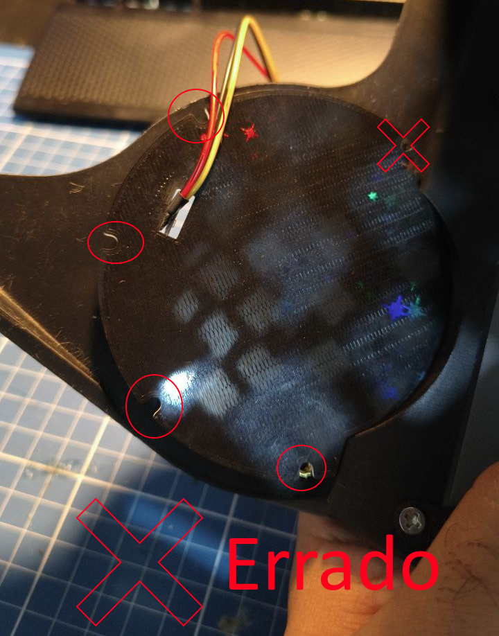

# Guia de impressão e montagem

Imprimir o protopanda é mais fácil que o modelo MK16 original. Precisa de menos suporte e tem alguns recursos que ajudam a reduzir a quantidade de material de impressão. E Peso também.
Também adiciona um pouco de complexidade em outras partes, isso é para algumas partes ficarem mais bonitas, mais resistentes ou ter mais funcionalidades. 
Todas as peças do modelo protopanda podem ser trocadas pela sua versão do [MK16 original](https://www.thingiverse.com/thing:4894173).

# Modelos 3d

Você pode baixar os modelos do protogen versão protopanda [aqui](https://www.thingiverse.com/thing:7188042)

# Peças

**O básico que você precisa é uma impressora 3D com cama de 25x25cm.** De modo geral, tudo pode ser impresso em PLA... MAASSSSS isso não é recomendado para algumas peças por questões de resistência.
PLA tem um problema que em temperaturas acima de 50ºC ele fica maleável, e muito calor, tipo dentro de um carro quente no sol, ele pode empenar. Fora que PLA com o tempo fica mais duro e quebradiço.

> Algumas partes do guia vão recomendar usar ASA ou ABS, mas eles são tóxicos durante a impressão. Pense bem no que você precisa.

Abaixo você pode clicar em cada uma das imagens. Cada seção tem um guia de impressão, configurações recomendadas para cada peça, ferramentas e materias.

| Frame frontal                                | Headset                                      | Parte de trás da cabeça                                             |
|-------------------------------------------------|------------------------------------------------------|--------------------------------------------------------------------|
|    |  |  |
| [Materiais](#materiais-do-frame-frontal)       | [Materiais](#materiais-do-headset)              | [Materiais](#materiais-da-parte-de-trás)                       |
| [Impressão](#guia-de-impressão-do-frame-frontal) | [Impressão](#guia-de-impressão-do-headset)      | [Impressão](#guia-de-impressão-da-parte-de-trás)               |
| [Montagem](#montagem-do-frame-frontal) | [Montagem](#guia-de-montagem-do-headset)        | [Montagem](#guia-de-montagem-da-parte-de-trás)                  |

| Suporte de LED                                   | Clipes                                                | Orelhas                            |
|-------------------------------------------------|-------------------------------------------------------|------------------------------------|
|  |  |  |
| [Materiais](#materiais-do-suporte-de-led)          | [Materiais](#materiais-dos-clipes)                        | [Materiais](#materiais-das-orelhas)    |
| [Impressão](#impressão-do-suporte-de-led)          | [Impressão](#impressão-dos-clipes)                        | [Impressão](#impressão-das-orelhas)    |
| [Montagem](#montagem-do-suporte-de-led)            | [Montagem](#montagem-dos-clipes)                          | [Montagem](#montagem-das-orelhas)      |

| Juntando tudo |
|--------- |
|  |
| [Materiais](#materiais-para-juntar-todas-as-peças) |
| [Montagem](#montando-tudo-junto) |

## Todas as ferramentas necessárias

* Impressora 3D com uma área de 25x25cm (idealmente que imprime colorido)
* Placa lisa de PEI para os LEDs laterais (Se tiver aquela com as estrelas fica muito top)
* Orca slicer (ou outro fatiador com recursos parecidos)
* Ferro de solda com ponta para inserto de latão
* 4x parafusos M4 10mm (temporários)
* Chave de fenda
* Alicate de corte reto
* Sargento (opcional)

### Todos os Consumiveis necessários
> Quase todas as peças que requerem parafuso, podem ser simplesmente coladas. No mk16 as peças são coladas com excessão do frame frontal
* Cola de dois componentes (araldite ta ótimo)
* 10x inserto de latão M3 (5~7mm de altura)
* 18x iinserto de latão M3 3mm de altura
* 8 a 16x inserto de latão M4 (5~7mm de altura)
* 8 a 16x parafusos M4 de cabeça chata 10~15mm
* 4x parafusos M3 de cabeça chata 10mm
* 12 a 18x parafusos M3 6mm
* 2x imãs de neodímio 10mmX2mm
* PETG, ASA e TPU
* PLA transparente
* PLA preto
* Fita de LED ws2812b de 2.7mm~5mm (ou uma matriz de LED 5x5)
* Super bonder
* Conector 3 vias PH 2.0MM com fios (ou outro conector de 3 pinos)

# Headset
[Voltar ao topo](#peças)

## Materiais do Headset

### Ferramentas
* Impressora 3D
* Orca slicer (ou outro fatiador com recursos parecidos)
* Ferro de solda com ponta para inserto de latão
* 4x Parafusos M4 10mm (temporários)
* Chave de fenda
* Alicate de corte reto
* Grampo C (opcional)

### Materiais consumiveis
* Cola de dois componentes (araldite ta top)
* 10x insertos de latão M3 (4~6mm de altura)
* Filamento ASA ou PLA
* 2x imãs de neodímio 10mmX2mm
* 6x insertos de latão M3 3mm de altura

## Guia de impressão do Headset

### Parte 1
Os fones podem ser impressos totalmente em PLA. Vai ficar bão e não tem partes finas que quebram ou trincam fácil. **O ideal é usar ASA.** Dá pra usar PETG, mas PETG é bem chato de lixar.
Não tem muito problema ir de PLA aqui.

* Material: ASA ou PLA
* Altura da camada: 0.16mm ou menos
* Suportes: árvore
* Brim: é uma boa, mas não é totalmente necessário

Coloque a peça com a parte de trás na placa assim:

Manda imprimir e é isso!

### Parte 2
As asinhas ou "nadadeiras" também podem ser em PLA. Vai ficar bom e não tem partes finas que quebram fácil. **O ideal é usar ASA.** Dá pra usar PETG, mas PETG é bem chato de lixar.
Não tem muito problema ir de PLA aqui.

* Material: ASA ou PLA
* Altura da camada: 0.16mm ou menos
* Suportes: árvore
* Brim: é uma boa, mas não é totalmente necessário. E pode afetar a superficie fazendo que vocÊ tenha que lixar mais.

Quando você carregar o arquivo STL, provavelmente vai aparecer num ângulo estranho:

Vai precisar deixar ela reta. No Orca, selecione a ferramenta de deitar a peça e escolha uma dessas áreas bem em baixo:

Selecione alguma área:

Quando posicionada, deve ficar mais ou menos assim:

Dá pra imprimir assim, mas da pra imprimir as 2 juntas. Faça uma cópia do modelo selecionando e apertando ctrl-c e depois ctrl-v.
Depois clique com o direito no novo corpo e selecione espelhar, depois espelhar no eixo Y. Se estiverem muito perto, afaste um do outro. Deve ficar assim:

Na hora de imprimir, deve ficar assim:

Se ficar uns artefatos na pontinha lá no final, aumente o ângulo limite do suporte ou adicione um "forçar suporte" na ponta.

**MAS MOCK, DÁ PRA IMPRIMIR COM A PARTE DE TRÁS NA MESA EM VEZ DISSO????**

Dá sim! Mas o problema que a original do MK16 tem uns curvas suaves que a maioria das impressoras vai ter dificuldade de reproduzir nessa quando impresso nessa posição. É uma ótima ideia se você tiver um modelo personalizada com superfície reta, ai dá até pra usar ironing lá.

## Guia de montagem do Headset

Agora que você tem tudo pronto, é uma boa hora pra lixar e tirar todos os restos de suporte. Fazer isso depois vai ser mais difícil. Se quiser dá até para passar um primer, só fica de olho que nem todas as partes são expostas.

Agora pegue dois dos parafusos M4, coloque em dois furos de um lado até que saia do outro lado. Use eles pra alinhar as asinhas assim:

Desparafuse um pouco até que a asinha fique encostando bem noi headset. Ai você aperta um pouco os parafusos pra que eles entrem um pouco na asinha e ela fique fixa. Isso é só pra alinhar.
Faça isso dos dois lados.

Depois que você tiver tudo certinho, partiu misturar a cola, mistura bastante viu?

Agora espalha entre os furos dos em cada asinha. Evite colocar muita cola e evite colocar muito perto da borda de fora ou dos furos.
Colocar cola demais ou muito perto da borda vai fazer a cola vazar pro lado de fora... e você vai ter que limpar.
Cola no furo do parafuso vai dificultar na hora de tirar os parafusos.

Guarde um pouco de cola pro imã no topo da cabeça!

Agora coloque as duas asinhas no lugar e use os parafusos pra manter elas alinhadas. **Não aperte até o fim!**

Se os parafusos não forem suficientes pra deixar as asinhas completamente alinhadinhas e encostando nas laterais, mete uns 2 sargentos ali pra segurar, só não aperta muito pra n marcar.

Agora use a cola que sobrou pra preencher um pouco o furo no topo da cabeça, e coloque o imã lá:

Passe um pouco de cola por cima do imã e, se tiver alguns imãs sobrando, coloque do outro lado pra segurar ele bem no lugar:

Agora é uma boa ideia limpar qualquer respingo de cola que tenha saído pelas bordas ou marca de dedo sujo de cola pela peça. **E lembre-se de lavar muito bem as mãos também!**
Deixe parado até a cola secar completamente.

__tic tac tic tac__

Agora pegue seus insertos de latão e seu ferro de solda com a ponta própria e esquente a 300ºC (se for PLA, 250ºC):

Coloque o inserto M3 (o comprido) bem em cima do furo, coloque o ferro de solda direto nele e alinhe o máximo que der com o buraco. Aplicando só um **pouquinho** de pressão! Espere alguns segundos até ver o inserto entrando no furo e derretendo o plástico em volta.
Aí aplique um pouco mais de pressão, mas não vá muito rápido. A ideia é que ele entre devagar enquanto derrete o plastico em volta. Pode empurrar ele uns 2~3mm abaixo da superficie. Se o inserto tiver 7mm, pode ir até ele ficar na superfície. Se for de 5mm, enfia uns 2~3mm.

Faça isso em todos os furos que não têm parafuso. Depois tire os parafusos e faça o mesmo neles:

Pra finalizar, pegue os insertos M3 de 3mm e coloque nos furos atrás do headset. Coloque só o suficiente pra ficarem alinhados com a superfície. Tente manter o mais reto possível em relação à superfície:

Quando terminar, essa parte está completa!

# Parte de trás da cabeça
[Voltar ao topo](#peças)

## Materiais da parte de trás

### Ferramentas
* Impressora 3D
* Orca slicer (ou outro fatiador com recursos parecidos)
* Ferro de solda com ponta para inserto de latão
* Chave de fenda
* Alicate de corte reto

### Consumiveis
* Filamento ASA ou PLA
* 6x insertos de latão M3 3mm de altura

## Guia de impressão da parte de trás

### A parte de trás em si

Modelos com buracos e partes "flutuantes" recisam de suporte pra que o material não caia. Sorte que você está lidando com um modelo que na MAIORIA partes não precisa (eficiência >:3)!
Ele foi desenhado pra precisar do mínimo de suporte possível e tem furos pra que você consiga escutar melhor e ventilar... Mas no fim é pra econimizar material e não gerar muito lixo.

* Material: ASA, PETG, PLA. PETG é recomendado
* Altura da camada: pode usar 0.24. A qualidade não importa muito aqui
* Suportes: árvore, com um bloqueador de suporte

O modelo tem uma superfície reta, primeiro use a ferramenta "Deitar na face" pra colocar o modelo virado pra cima:

Assim:

Se imprimir assim, tem uma grande chance do modelo balançar e o resultado ficar horrível, ou simplesmente descolar da mesa. Por isso vamos ativar os suportes:

**MOCK. TEM UM MONTE DE SUPORTE AÍ. QUE ISSO?!**

Pois é, bem zoado. Só que esses suportes não importam muito pra falar a verdade. Só atrapalham e são desperdício de material.
Então precisamos desativar a MAIORIA deles. Pra isso, vamos adicionar um "bloqueador de suporte":

Coloque ele assim, deixando a parte de baixo do capacete desse jeito, deixe 1~2cm. Fazemos isso porque esses suportes funcionam como uma base maior e uma camada extra de adesão na mesa.
Eles devem sair fácil quando terminar:

Deve ficar assim:

Quando terminar, vai ficar BUNYTO:

## Extensor

As vezes, sua cabeça é grande e ai precisa fazer um pouco maior. Pra isso temos essa peça ai que deixa a cabeça mais longa. No caso ela aumenta 2,5cm.

* Material: ASA ou PLA
* Altura da camada: qualquer uma
* Suportes: não precisa
* Brim: boa ideia, mas não obrigatória

Mesmo processo da parte de trás. Carregue o modelo, deixe ele reto, desabilite todos os suportes:

Imprimiu ta pronto, cabô.

## Guia de montagem da parte de trás

Agora com todas as peças prontas, vamo finalizar o que precisa.

Agora pegue seus insertos de latão, seu ferro de solda com ponta própria. Esquente a 300ºC se estiver usando PETG ou ASA, 250ºC para PLA:

Tem 6 furos onde esses insertos devem ser colocados:

Primeiro, coloque o capacete de lado, tenta deixar em um lugar em que ele n fique muito bambo. Então coloque um dos insertos com a parte fina virada pro furo. Coloque a ponta do ferro de solda em cima do inserto e espere alguns segundos até ele começar a
derreter o plástico e entrar no furo. Tente fazer isso devagar, sem forçar muito. Use o mínimo de força possível e tente não afundar além da superfície. Mantenha o ferro de solda o mais reto possível em relação à superfície:

Depois você colocar todos os 6 é só colocar no extensor, vamos fazer o mesmo com ele:

Cabô >:3

# Frame frontal
[Voltar ao topo](#peças)

A Frame frontal é onde geralmente vai toda a eletrônica. Neste ponto, não tenho peças sobrando pra filmar o processo inteiro de montagem. Então vou mostrar só o processo de impressão por enquanto.

## Materiais do Frame frontal

### Ferramentas
* Impressora 3D
* Orca slicer (ou outro fatiador com recursos parecidos)

### Consumiveis
* PETG preto

## Guia de impressão do Frame frontal

* Material: PETG preto
* Altura da camada: 0.12mm~0.24mm
* Suportes: árvore
* Brim: nenhuma

Não tente imprimir em PLA (vai dá ruim, confia). Vai rachar em algum momento. **PETG ou ASA são obrigatórios.**

Carregue o modelo e coloque reto na mesa:

Ao clicar em "Fatiar", você vai notar que aparecem alguns suportes:

A maioria desses suportes não é necessária, então vamos clicar com o direito e adicionar um bloqueador de suporte em cubo:

Redimensione e mova pra ficar assim, cobrindo toda a Frame frontal, exceto a parte de trás dela:

Agora fatie e você vai notar que só aparecem dois suportes:

É isso. Imprima assim mesmo que dá bom.

## Montagem do Frame frontal

A Frame frontal é onde geralmente vai toda a eletrônica. Neste ponto, não tenho peças sobrando pra filmar o processo inteiro de montagem. Então vou mostrar só o processo de impressão por enquanto.

# Suporte de LED
[Voltar ao topo](#peças)

É recomendado ter uma impressora 3D multicolorida aqui. Dá pra fazer sem uma também, mas o resultado pode não ficar tão bom.
Esta seção vai exigir um pouco de solda eletrônica. Você pode usar os suportes de LED originais do MK16 se quiser, este guia
só existe porque do jeito que fiz os suportes, acho que ficou mais bonito.

Você também pode trocar a fita de LED ws2812b por um LED de cor única também. Estou usando ws2812b porque são RGB. Dá pra usar matriz de led, mas não fica tão bom.

## Materiais do suporte de LED

### Ferramentas
* Impressora 3D (multicolor se possível)
* Placa lisa de PEI (aquela com as estrelinha fica muito top)
* Orca slicer (ou outro fatiador com recursos parecidos)
* Ferro de solda e materias de solda

### Consumiveis
* PLA branco ou qualquer cor reflexiva
* PLA preto
* PLA transparente
* Fita de LED ws2812b de 2.7mm~5mm
* Super cola
* Conector 3 vias PH 2.0MM com fios ou outro conector de 3 pinos que você vá usar

## Impressão do suporte de LED

### Imprimindo o suporte

* Material: PLA branco ou reflexivo. PLA preto na primeira camada
* Altura da camada: 0.16mm
* Suportes: nenhum
* Brim: nenhuma

Primeiro você vai carregar o modelo e depois colocar reto na mesa:

Depois clique no modelo, aperte Ctrl+C e depois Ctrl+V pra criar uma cópia.

Clique com o direito em um deles e selecione espelhar e depois espelhar no eixo Y:

Então eles devem ficar assim na mesa:

Deixe tudo branco. Se tiver algum PLA prateado ou outra cor que reflita luz melhor que o branco, use ele.

Agora, se você tiver uma impressora multicolor, deixe a primeira camada preta. Se não tiver, pode usar PLA preto e pausar a impressão no meio pra trocar o filamento:

### Imprimindo o logo

* Material: PLA transparente ou PLA preto
* Placa PEI: **LISA**
* Altura da camada: não importa
* Preenchimento: 100%
* Suportes: nenhum
* Brim: não
* Padrão de preenchimento sólido interno: retilíneo alinhado

Agora vem uma parte um pouco complicada. Se você não tiver uma impressora que imprime colorido, pode cortar um círculo de acrílico a laser e encaixar no modelo. Ou pode imprimir um círculo usando PLA transparente e encaixar no círculo de fora.
Usar uma placa PEI lisa aqui é importante. Dá pra usar uma texturizada, mas ai você vai ter que imprimir ela de cabeça pra baixo, ligar suporte e se quiser uma superficie boa, tem que habilitar "ironing"

#### Método sem impressora colorida

Ao importar o modelo, ele vai ser uma peça sólida:

Então você precisa clicar no botão "dividir em objetos":

Assim o objeto vai virar dois. O círculo interno e o externo:

Mude o filamento de um dos círculos pro transparente. Lembre-se de mudar o preenchimento pra 100% e o padrão de preenchimento pra alinhado e retilíneo:

Depois separe eles, desabilite os anéis e imprima primeiro os círculos internos, depois imprima os círculos em PLA preto:

Outra opção é cortar um círculo de 57.7mm em acrílico a laser:

Depois você precisa imprimir um adesivo preto com fundo branco ou transparente e colar por cima:

#### Método com impressora colorida

Primeiro importe o modelo e deixe ele virado pra baixo. Deixe tudo preto!

Para o logo, pegue um SVG do seu logo. Você pode usar [este site que tem vários SVGs](https://www.svgrepo.com/).
Escolha um SVG, baixe, depois clique com o direito no modelo e selecione "Add modifier" e escolha um SVG:

Ajuste o tamanho e posição do SVG pra ficar no meio do circulo. Aumente a espessura fazendo ele atravessar o modelo em cima e em baixo:

Se por algum motivo o modelo ficar pra cima, selecione ele, clique com o direito e escolha "Drop".
Agora na seleção de objetos, mude o filamento do SVG pro transparente:

Quando fatiar, deve ficar assim:

Mas peraí, não terminou. A gente quer que a luz passe por ele... E se você notar, a parte que deveria ser transparente está preta!

Então precisamos adicionar um modificador em cubo pra deixar transparente de novo. Mesmo processo do SVG, mas pra um cubo. Tente posicionar ele logo acima da segunda superfície. Assim:

Isso vai fazer a superfície de cima ficar assim:

Enquanto a superfície de baixo fica assim:

Imprima dois! Lembre-se que talvez precise virar um dos círculos. Se tiver texto, lembra de espelhar também.

### Montagem do suporte de LED

Primeiro, tenha certeza que comprou a fita de LED certa. Normalmente as fitas de LED têm 12mm de largura. A gente quer as de 2.7mm até 5mm (você vai achar no aliexpress):

Depois de conseguir a fita certa, corte em duas tiras de 21~22cm:

Agora vamos soldar os terminais da fita. Confere que tá soldando no sentido certo da fita. Essas fitas de LED endereçáveis têm uma seta indicando a direção:

Depois de soldar, lembre-se de colocar um tubo termo-retrátil pra cobrir os contatos, ou depois cubra com fita isolante ou cola quente:

Teste pra ver se estão funcionando. Estou testando usando um protopanda, mas você pode usar um arduino ou esp32 com um exemplo da [biblioteca fastled](https://docs.arduino.cc/libraries/fastled/):

Embaixo dessas fitas tem uma fita adesiva, remova a proteção:

E enrole em volta das bordas internas do suporte de LED:

Se quiser, pode passar um pouquinho de super cola no começo e no fim da fita pra manter ela no lugar:

A parte de trás deve ficar assim:
> importante: idealmente, mantenha o fio descendo em cada lado, vai ser mais fácil de organizar depois

Agora tampe com a tampa!

Agora você deve escolher qual é melhor pra você.
O de cima é acrílico, o de baixo é PLA transparente com 100% de preenchimento:

Ou a parada do logo personalizado:

Outra opção é tentar usar matrizes 5x5. Mas os LEDs vão ficar visíveis:

E o pior, os leds estouram muito nas fotos e ficam visiveis ao olho nú (da pra perceber onde tá os leds):

Depois de decidir qual vai usar, pode usar só um pouquinho de super bonde. Mas **NÃO FAÇA ISSO AGORA**!! Você vai precisar alinhar quando terminar de montar no protogen.
E não use muita cola porque elas já encaixam certinho no furo da asinha. E se precisar trocar a fita de LED algum dia, dá pra abrir fácil assim.

# Clipes
[Voltar ao topo](#peças)

Os clipes são usados pra juntar a [parte de trás da cabeça](#parte-de-trás-da-cabeça) com o [Headset](#headset) sem precisar colar. Dá pra colar também, mas usar parafusos deixa mais resistente e mais fácil de trocar no futuro.

## Materiais dos clipes

### Ferramentas
* Impressora 3D
* Orca slicer (ou outro fatiador com recursos parecidos)

### Consumiveis
* PETG, ASA, ABS ou algo mais resistente

## Impressão dos clipes

* Material: PETG, ASA, ABS ou algo mais resistente (PETG recomendado)
* Altura da camada: não importa
* Suportes: não
* Brim: nenhuma

É isso mesmo que você ouviu. PETG ou ASA. **NÃO TENTE IMPRIMIR ISSO EM PLA.** Vai quebrar...
Imprime pelo menos 8 de cada. O pequeno só é usado caso você não vá usar o extensor de cabeça. Se precisar de espaço extra, imprima o [extensor](#extensor) e use os clipes grandes.

Carregue os modelos e depois, clique em deitar reto:

E coloque cada um virado pra baixo na mesa. Deve ficar assim:

Depois, copie cada uma dessas peças até ter pelo menos 8 de cada:

impresso, ta pronto. Os que sobrarem, guarde de reserva.

## Montagem dos clipes

Eles devem juntar a [parte de trás da cabeça](#parte-de-trás-da-cabeça), o [extensor](#extensor) e os [Headset](#fones-de-ouvido).
Para o guia de montagem, veja a seção [Montando tudo junto](#montando-tudo-junto).

# Orelhas
[Voltar ao topo](#peças)

## Materiais das orelhas

O modelo suporta 2 ou 4 orelhas. Dá pra escolher imprimir só duas ou as quatro. Ou pular esta seção completamente e fazer de espuma mesmo.
Vamos imprimir em TPU. Dá pra imprimir em PLA ou PETG, mas podem ficar pesadas demais ou quebrar fácil, já que você não vai conseguir dobrar.

### Ferramentas
* Impressora 3D
* Orca slicer (ou outro fatiador com recursos parecidos)
* Ferro de solda com ponta para inserto de latão
* Chave de fenda

### Consumiveis
* Filamento de TPU
* 8 a 16x insertos de latão M4 (5~7mm de altura)
* 8 a 16x parafusos M4 de 10~15mm
* Super bonder

## Impressão das orelhas

> Aviso: Imprimir com TPU é bem chato e algumas impressoras não lidam bem com ele. Até o momento nesse guia tentei explicar cada passo com o máximo de detalhe possível. Mas imprimir com TPU tem suas dificuldades. E infelizmente não tenho como fazer um guia pra imprimir com TPU, então recomendo ir atrás de um guia e se familiarizar com o material primeiro.

* Material: TPU
* Altura da camada: qualquer uma
* Suportes: nenhum
* Brim: nenhuma
* Infill: **10% Gyroid**
* Camadas de cima: 0
* Paredes: 0

Elas são impressas em TPU pra serem flexíveis e ultra resistentes:

Você vai ver que as orelhas são divididas em partes. Isso porque são grandes demais e não cabem na impressora:

Lembre de mudar o infill para 10%, remover as paredes e as camadas de cima (teto).
Depois adicione alguns cilindros modificadores nesses furos. Eles devem ter 3 paredes, são os lugares onde os insertos vão ficar:

Quando fatiar, deve ficar assim:

Dá pra colocar duas orelhas ao mesmo tempo **(LEMBRE DE ESPELHAR ELAS)**. Quando terminar, abuse da do super bonder pra colar a ponta na orelha.

Depois de impressas, esquente seu ferro de solda por volta de 300~350ºC com uma ponta M4 e coloque todos os quatro insertos de latão M4.

# Juntando todas as partes

[Voltar ao topo](#peças)

## Materiais para juntar todas as peças

### Tools
* Chave de fenda
* Alicate de corte reto

### Consumables 
* 1x [Frame frontal](#frame-frontal)
* 1x [Headset](#headset)
* 1x [Parte de trás da cabeça](#parte-de-trás-da-cabeç)
* 6x [Clipes](#clipes) 
* 1x [Extensor](#Extensor) (opicional)
* 2x [Suporte dos leds](#suporte-de-led)
* 2x~4x [Orelhass](#orelhas) (opicional)
* 12x~18x parafusos M3 6mm (cabeça chata)
* 8x~16x parafusos M4 15mm (cabeça chata)

## Montando tudo junto

### Parte de trás da cabeça e orelhas

Primeiro posicione quatro parafusos M4 nos furos, empurre ou aparafuse nos furos até eles começarem a aparecer do outro lado:

Depois posicione a orelha esquerda com o parafuso de cima, comece a girar o parafuso pra prender ela no inserto. Então alinhe a orelha com o de baixo. Faça isso com todos os parafusos.
Depois parafuse até que ela esteja totalmente presa.

Faça isso com todas as quatro orelhas.

### Parte de trás da cabeça e Headset

**MAS MOCK, EU NÃO QUERO USAR PARAFUSOS, DÁ PRA USAR O MÉTODO ANTIGO E COLAR?**

Dá sim.

Mas vou mostrar com parafusos!
A ideia é usar os clipes pra prender a parte de trás com os fones. Vou mostrar como fazer com o extensor; se não precisar dele, use os clipes menores.
Pegue 6 clipes e 6 parafusos M3 6mm. Parafuse os clipes no lugar com pressão suficiente pra que fiquem no lugar, mas possam girar se você empurrar eles:

Agora encaixe o extensor (se não for usar o extensor, use os clipes pequenos faça isso com o headset no lugar). Você vai notar que o alinhamento pode ser um pouco chatinho. Por isso existe um furo de alinhamento:

A ideia é usar um pedaço de filamento ou outra coisa pra manter as partes no lugar. Se o furo estiver muito pequeno, você pode alargar com uma broca de 1.7mm:

Aqui estou usando um pedaço de filamento PLA pra alinhar:

Agora coloque todos os parafusos no extensor e aperte todos. Mas não aperte demais:

Agora é só encaixar os Headset. Com os furos de alinhamento, vai ficar no lugar certo, pronto pra aparafusar:

Depois que tudo estiver preso com parafusos, você pode colocar uma pitada de cola no pedaço de filamento na parte de trás da cabeça e cortar com um alicate de corte reto. (Ou só tirar ele mesmo)

### Headset e LEDs laterais

Verifique de que lado vai cada um dos suportes de LED:

Então é só empurrar até encaixar. Você pode usar um parafuso M3 pra segurar no lugar por enquanto. A Frame frontal vai prender ele lá:

Agora, você pode colocar a tampinha com o logo. Porém, se você não for lixar mais nada ou pintar, pode colar agora. Caso contrário, deixe a cola pra última coisa antes de considerar finalizado:

### Headset e Frame frontal

Estamos quase lá!

Primeiro, você vai precisar posicionar as duas partes e então deslizar a Frame frontal, dá pra fazer ele entrar por baixo. Por cima também dá, é só apertar a parte de trás do frame para que ele passe, aperta de leve.

Agora você vai ter que alinhar esses dois furos, faz só de um lado por hora:

Use os parafusos M3 10mm pra fixar no lugar:

Aperta bem os parafusos, mas não precisa por muita força, se não você pode arrancar o inserto ou amassar o plástico do frame ou do headset.

**E PRONTO! Está terminado!**

